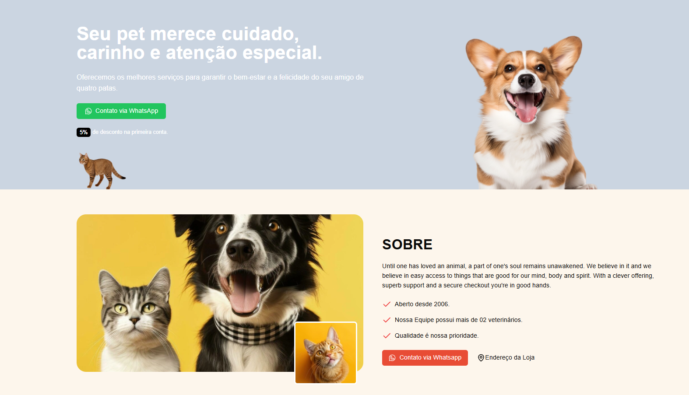

# Apresentação

* Como ficou no Desktop:

## Bibliotecas utilizadas:

## Comandos

* Inicializar o shadcn: `npx shadcn@latest init`
 

* Instala o componente de botão do shadcn: `npx shadcn@latest add button`
 

* Instala o componente de carrossel do shadcn: `npm install embla-carousel-react --force`
 

* Instala o phosphor: `npm install @phosphor-icons/react`

### Ref.

* Links:
  
[Link do vídeo](https://www.youtube.com/watch?v=5tpX4iTdg5A)

[Link da documentação do Shadcn/Ui](https://ui.shadcn.com/docs)

[Link da documentação do Phosphor](https://phosphoricons.com/)
