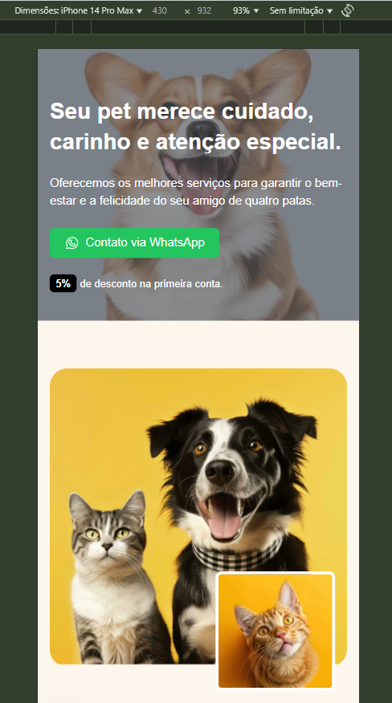

## Apresentação

#### Tecnologias

* > NextJS
* > TypScript
* > DataOS | Motion
* > ShadCN UI
* > TailWindCSS  

#### Telas

* > Desktop:

* > Mobile:

## Bibliotecas utilizadas:

## Comandos

* Inicializar o shadcn: `npx shadcn@latest init`
 

* Instala o componente de botão do shadcn: `npx shadcn@latest add button`
 

* Instala o componente de carrossel do shadcn: `npm install embla-carousel-react --force`
 

* Instala o phosphor: `npm install @phosphor-icons/react`
